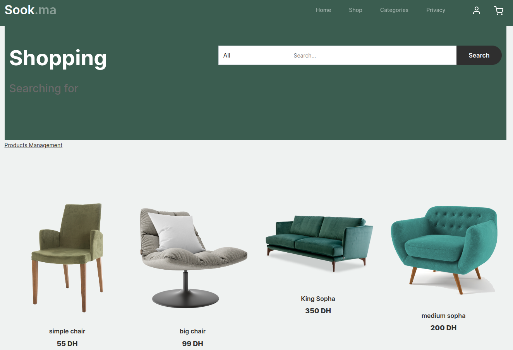
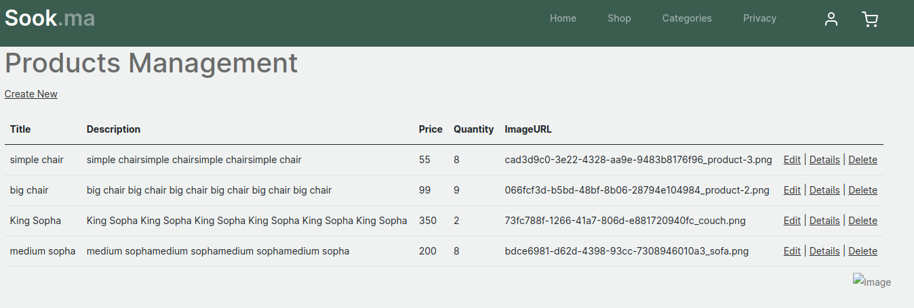

# ilisi_3_dotnet_MVVM_souk_ma
le projet est un site web de vente en ligne des produits diverses

## Getting Started
vous pouvez telecharger le projet et l'executer sur votre machine locale en suivant les etapes suivantes:
### lancer la base de donnees SQLServer en executant le fichier docker-compose.yml dans le repertoire docker dans  dossier data du project
```bash
docker-compose up -d
```
### creez la base de donnees en executant la commande suivante
```bash
dotnet ef database update
```

### lancer le projet en utilisant la commande suivante
```bash
dotnet run
```

## utilisation du projet 
### liste des produits
vous pouvez entrer dans la page `/Products` afin de pouvoir voir la liste des produits et les ajouter dans votre panier


### gestion des produits : ajout de nouveaux produits
comme vous pouvez ajouter de nouveaux produits (puisque vous n'aurai aucun initialement), en passant vers la page `/Products/Admin` et cliquer sur le bouton `Create New`
